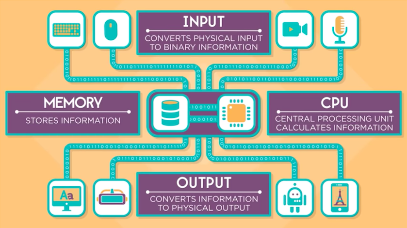

# Cara Kerja Komputer

Komputer adalah perangkat elektronik yang berguna untuk mengolah informasi. 

Ada 4 hal yang dilakukan komputer:
1. Input: memasukkan informasi.
2. Store: menyimpan informasi. 
3. Process: memproses informasi.
4. Ouput: mengeluarkan informasi.

Tiap hal tersebut dilakukan oleh komponen yang berbeda.

## Input
Mouse, keyboard, microphone, kamera digital, sensor digital, dan gps, adalah contoh jenis peralatan input. Fungsinya mengambil informasi dari luar komputer dan mengubahnya menjadi informasi biner. 

Biner adalah sistem penulisan angka menggunakan dua simbol, yaitu 0 dan 1. Semua komunikasi antar komponen di dalam komputer menggunakan sistem bilangan ini.

Penjelasan singkat mengenai sistem biner dan data, bisa kamu lihat di sini: [https://www.youtube.com/watch?v=USCBCmwMCDA](https://www.youtube.com/watch?v=USCBCmwMCDA)

## Store & Process

Data biner tersebut kemudian diproses oleh CPU (central processing unit) menggunakan intruksi yang sudah terpasang di memori. Ada ribuan intruksi untuk sekedar menyimpan dan menampilkan tiap huruf. Hasil pemrosesan itu kemudian disimpan lagi di memori.

Selain intruksi untuk menampilkan huruf, ada lagi intruksi untuk perhitungan matematika, intruksi untuk menyimpan di memori, intruksi untuk meneruskan ke output, dan sebagainya. Semua intruksi tersebut diatur oleh software yang biasa disebut Sistem Operasi. Di dalamnya terdapat berbagai macam aplikasi yang dibuat untuk tujuan berbeda.

Penjelasan singkat mengenai Sistem Operasi, bisa kamu lihat di sini:
[https://www.youtube.com/watch?v=xnyFYiK2rSY](https://www.youtube.com/watch?v=xnyFYiK2rSY)

## Output

Setelah pemrosesan selesai, infomasi yang sudah tersimpan di memori tersebut kemudian di-transfer ke perangkat output. Layar monitor, speaker, printer, robot adalah contoh-contoh peralatan output. Layar monitor, misalnya. Ia berguna untuk mengubah informasi biner menjadi gambar. Sedangkan speaker berguna untuk mengubah informasi biner menjadi suara.

## Penjelasan dalam bentuk animasi & audio-visual

Jika masih bingung dengan penjelasan tekstual, kamu bisa mencoba untuk menyimak playlist berikut: 
- [Introducing How Computers Work](https://www.youtube.com/watch?v=OAx_6-wdslM)
- [How Computers Work: What Makes a Computer, a Computer?](https://www.youtube.com/watch?v=mCq8-xTH7jA)
- [How Computers Work: Binary & Data](https://www.youtube.com/watch?v=USCBCmwMCDA)
- [How Computers Work: Circuits and Logic](https://www.youtube.com/watch?v=ZoqMiFKspAA)
- [How Computers Work: CPU, Memory, Input & Output](https://www.youtube.com/watch?v=DKGZlaPlVLY)
- [How Computers Work: Hardware and Software](https://www.youtube.com/watch?v=xnyFYiK2rSY)
